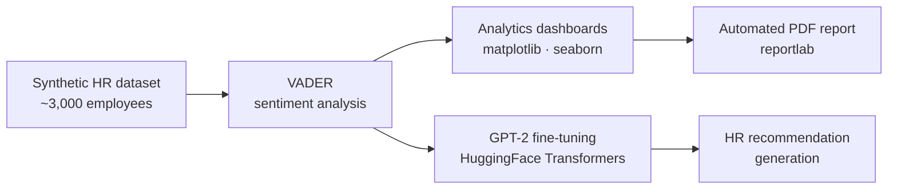
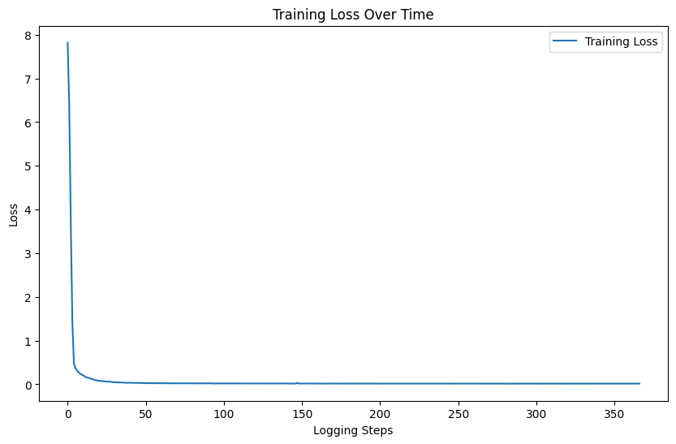
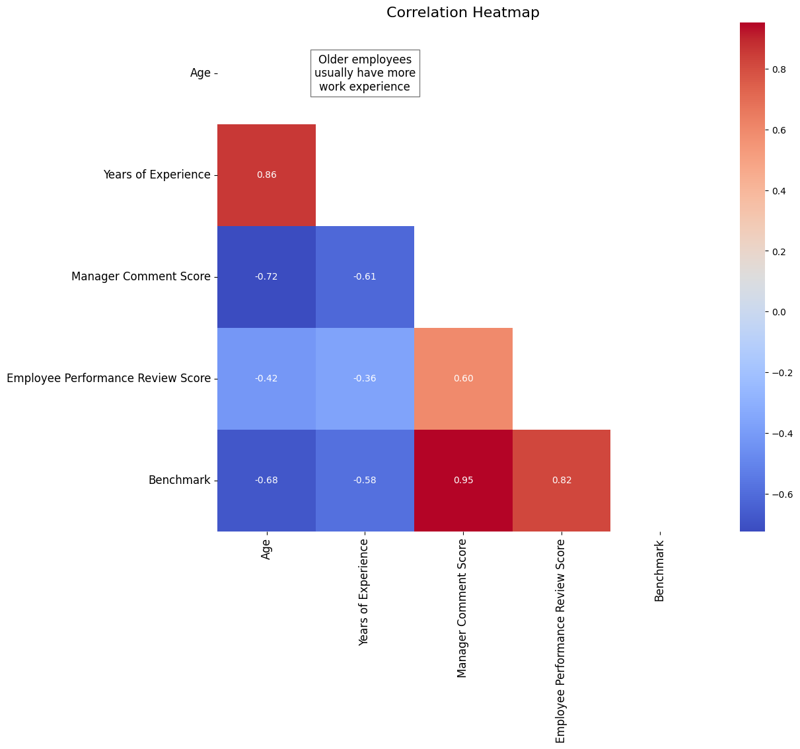
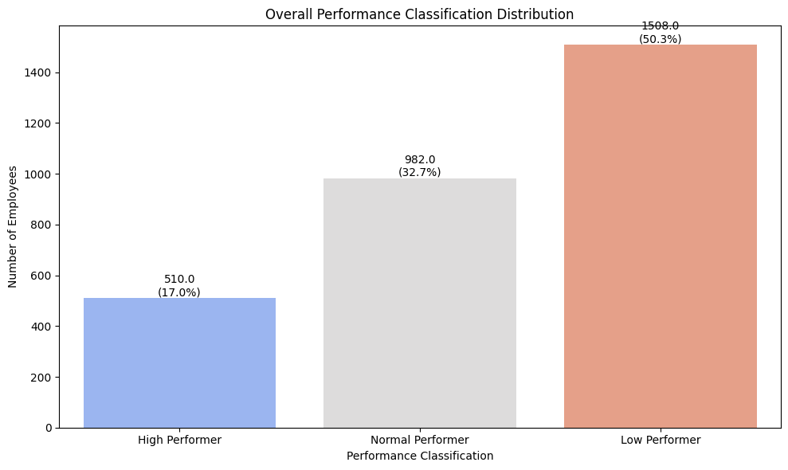
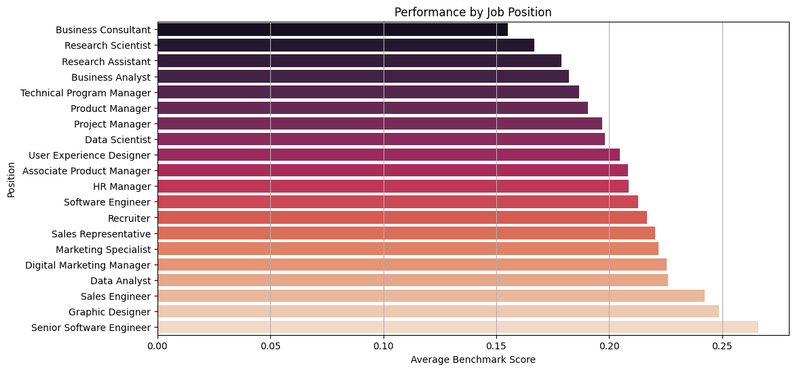
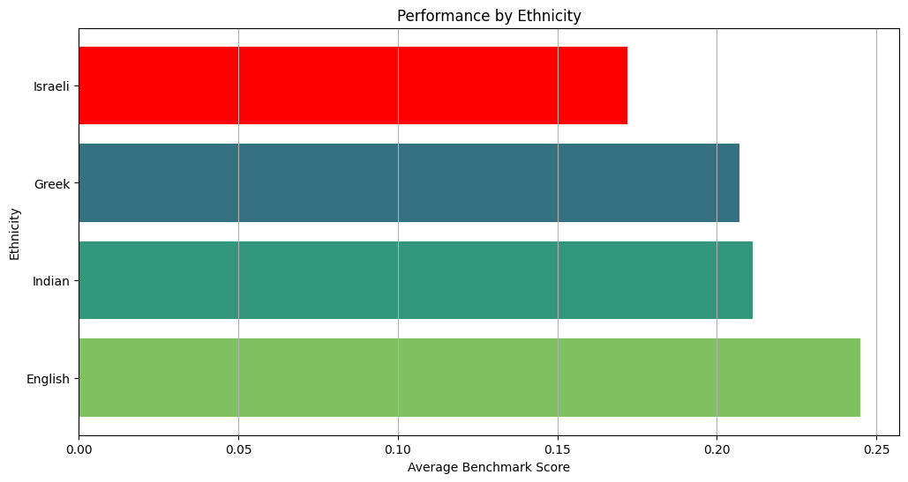
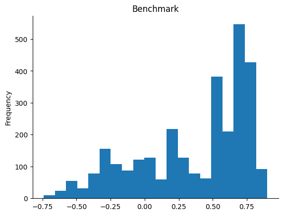

# 🧠 PerformanceReviewsAnalyser

### AI-powered sentiment analysis & HR recommendations for employee performance reviews

An end-to-end HR analytics tool that turns raw manager feedback into **insights** and **actionable recommendations**. It generates a realistic HR dataset, scores sentiment with **VADER**, visualises performance across the organisation, auto-generates a **PDF report**, and uses a **fine-tuned GPT-2 model** to write tailored HR recommendations from manager comments.

<p align="left">
  
  
  
  
</p>

---

## 🔭 Pipeline



---

## ✨ Key features

- **Synthetic data generation** — builds a realistic, diverse dataset of ~3,000 employees (names across English/Greek/Indian/Israeli ethnicities, 20+ job positions, departments, ages, experience, and themed manager comments).
- **Sentiment analysis** — classifies every manager comment as positive / neutral / negative using the **VADER** lexicon.
- **Analytics dashboards** — performance by ethnicity, age group, and job position; classification distribution; and a feature **correlation heatmap**.
- **Automated reporting** — compiles charts into a downloadable **PDF report** with `reportlab`, plus interactive upload/download widgets.
- **Fine-tuned GPT-2** — a GPT-2 model fine-tuned on manager-comment → HR-insight pairs to generate **tailored, constructive HR recommendations**.

---

## 🤖 The fine-tuned model in action

The model is prompted with `Manager Comment: {comment} HR_Insight:` and returns a constructive recommendation:

| Manager comment (input) | Generated HR recommendation (output) |
| --- | --- |
| *"John has consistently met his targets and has shown excellent teamwork."* | *"Your teamwork is highly valued, John — we encourage you to keep up the great work."* |
| *"Andreas lacks technical skills."* | *"To improve your technical expertise, participating in our upcoming technology workshop would be highly beneficial."* |

```python
def generate_hr_recommendation(text, model, tokenizer, max_length=100):
    prompt = f"Manager Comment: {text} HR_Insight:"
    input_ids = tokenizer.encode(prompt, return_tensors="pt").to(model.device)
    output_ids = model.generate(
        input_ids, max_length=max_length, num_return_sequences=1,
        pad_token_id=tokenizer.eos_token_id, no_repeat_ngram_size=2,
    )
    generated = tokenizer.decode(output_ids[0], skip_special_tokens=True)
    return generated[len(prompt):].strip()
```

**Training:** GPT-2 fine-tuned with the HuggingFace `Trainer`; the loss converges cleanly from ~8 to near-zero.



---

## 📊 Analytics & insights

A feature **correlation heatmap** reveals the strongest drivers of the performance benchmark (manager-comment score ≈ 0.95):



<table>
  <tr>
    <td><br/><sub>Overall performance classification (High / Normal / Low)</sub></td>
    <td><br/><sub>Average performance by job position</sub></td>
  </tr>
  <tr>
    <td><br/><sub>Average performance by ethnicity</sub></td>
    <td><br/><sub>Distribution of sentiment / benchmark scores</sub></td>
  </tr>
</table>

---

## 🧩 How it works (highlights)

**Sentiment scoring with VADER:**

```python
from vaderSentiment.vaderSentiment import SentimentIntensityAnalyzer

def categorize_comment(comment):
    analyzer = SentimentIntensityAnalyzer()
    score = analyzer.polarity_scores(comment)
    return "positive" if score["compound"] >= 0.05 else "negative"
```

The pipeline then derives a normalised **Benchmark** score per employee, classifies them as High / Normal / Low performer, builds the dashboards above, and exports both an Excel workbook and a PDF report.

---

## 🗂️ Repository structure

```
AI-applications-for-HRM/
├── README.md
├── requirements.txt
├── assets/                     # charts used in this README
│   ├── correlation_heatmap.png
│   ├── performance_classification.png
│   ├── performance_by_position.png
│   ├── performance_by_ethnicity.png
│   ├── performance_by_age.png · count_by_ethnicity.png
│   ├── sentiment_distribution.png
│   └── gpt2_training_loss.png
├── data/
│   └── employee_performance_reviews_sample.xlsx   # synthetic sample dataset
└── docs/
    └── PerformanceReviewsAnalyser_notebook.pdf    # full annotated notebook (code + outputs)
```

> ℹ️ The complete implementation — data generation, analytics, reporting, and GPT-2 fine-tuning — is documented end-to-end in [`docs/PerformanceReviewsAnalyser_notebook.pdf`](docs/PerformanceReviewsAnalyser_notebook.pdf). The original Colab notebook (`.ipynb`) can be added here as the runnable source.

---

## 📦 Dataset

A synthetic, privacy-safe dataset of ~3,000 employee records (no real personal data). Columns include:

`Employee Name` · `Ethnicity` · `Age` · `Years of Experience` · `Position` · `Department` · `Manager Comment` · `Manager Comment Score` · `Employee Performance Review` · `Benchmark` · `Performance Classification`

A sample workbook is provided in [`data/`](data/).

---

## 🚀 Getting started

```bash
git clone https://github.com/andreasN78/AI-applications-for-HRM.git
cd AI-applications-for-HRM
pip install -r requirements.txt
```

Then run the notebook (recommended in Google Colab for GPU-accelerated GPT-2 fine-tuning) to reproduce the data generation, analytics, reporting, and model training.

---

## 🧰 Tech stack

`Python` · `pandas` · `NumPy` · `matplotlib` · `seaborn` · `NLTK` · `vaderSentiment` · `scikit-learn` · `HuggingFace Transformers` · `PyTorch` · `ipywidgets` · `reportlab`

---

## 📝 License

© 2024 **Andreas Neofytou**. All rights reserved. Shared publicly for portfolio and demonstration purposes — see [`LICENSE`](LICENSE).

**Author:** Andreas Neofytou — [LinkedIn](https://www.linkedin.com/in/andreas-neofytou-283103198) · [GitHub](https://github.com/andreasN78)
